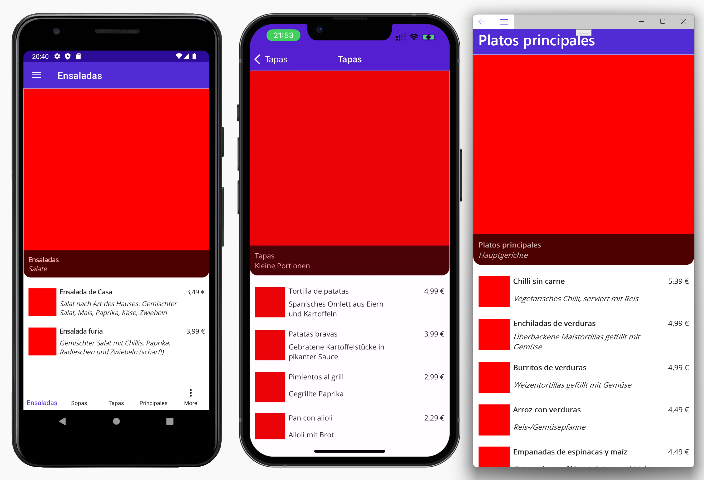

# Übung 2

- Öffnen Sie die App **ElVegetarianoFurio** in Visual Studio.
- Erstellen Sie einen neuen Ordner `Profile` im Projekt
- Erstellen Sie im Ordner Profile eine neue ContentPage mit dem Namen `ProfilePage.xaml` und registrieren Sie sie wie folgt in der Shell

```xml
    <ShellContent
        Title="Profil"
        ContentTemplate="{DataTemplate profile:ProfilePage}"
        Route="ProfilePage" />
```
- Registrieren Sie den XAML-Namespace `profile` analog zum Namespace `local` in der Shell wie folgt: `xmlns:profile="clr-namespace:ElVegetarianoFurio.Profile"`
- Bauen Sie die Maske `ProfilePage.xaml` analog zum Screenshot `lab.png` auf



